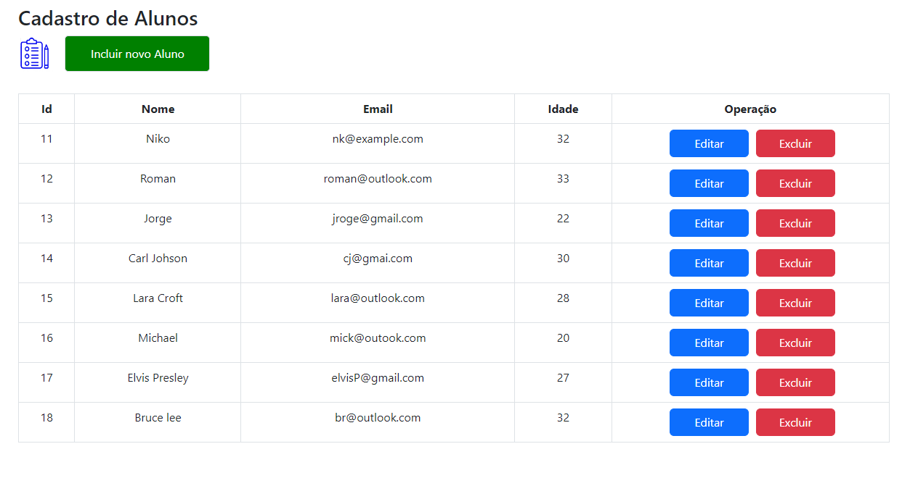

# Web Api / Consumindo API com React

Projeto prático, com referencia no curso da Udemy do [Macoratti](https://github.com/macoratti) para testar os conhecimentos, onde foi criado uma API utilizando a ASP.NET Core Web Api com C# e em seguida criado o projeto com React para consumir esta API localmente e realizar o CRUD

### Tecnologias/Ferramentas/Conceitos utilizados

#### Web API:
- [Visual Studio 2022](https://visualstudio.microsoft.com/pt-br/downloads/)
- [Entity Framework Core (ORM)](https://learn.microsoft.com/pt-br/ef/)
- [SSMS - SQL Server](https://learn.microsoft.com/pt-br/sql/ssms/download-sql-server-management-studio-ssms?view=sql-server-ver16)
- .NET 6.0
- Code First
- [Migrations](https://learn.microsoft.com/pt-br/ef/core/managing-schemas/migrations/?tabs=vs)
- Interface e Service
- [CORS](https://learn.microsoft.com/pt-br/aspnet/core/security/cors?view=aspnetcore-7.0)

#### React
- [VS Code](https://code.visualstudio.com/)
- [NodeJs - npm](https://nodejs.org/en/download)
- [Bootstrap](https://getbootstrap.com/docs/5.3/getting-started/introduction/)
- [Axios](https://axios-http.com/docs/intro)
- [Reactstrap](https://6-4-0--reactstrap.netlify.app/)

- 

